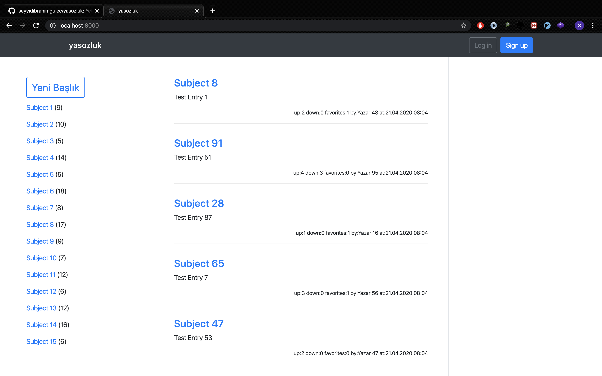
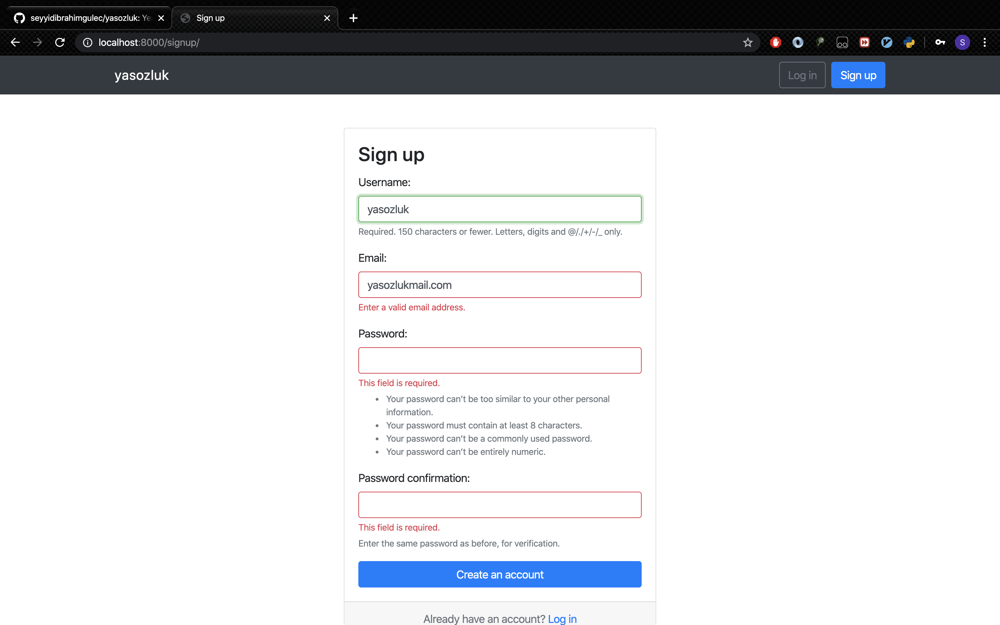
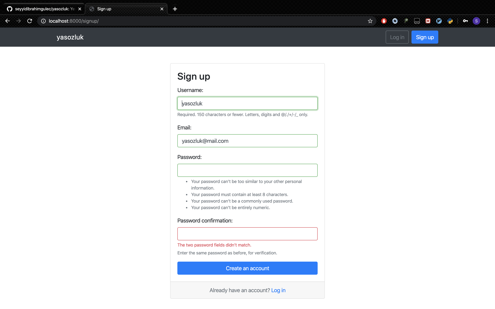
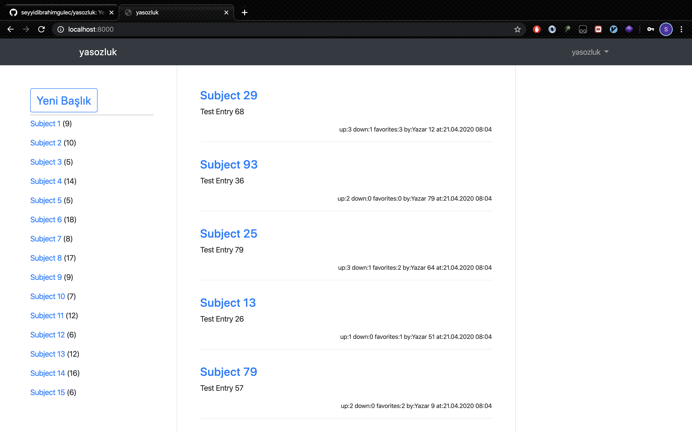
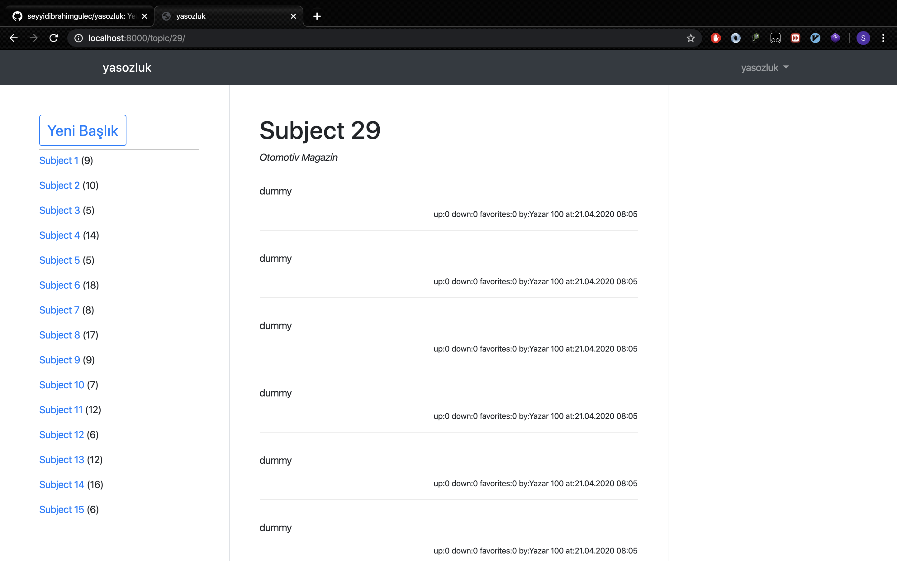
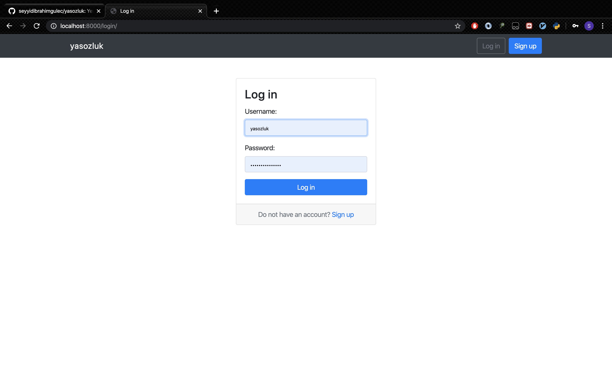
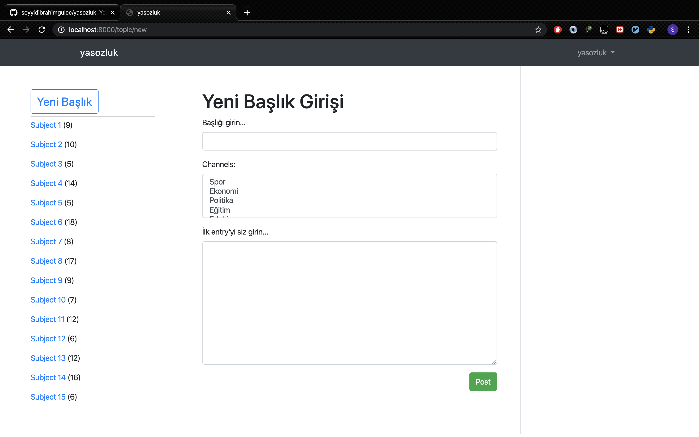
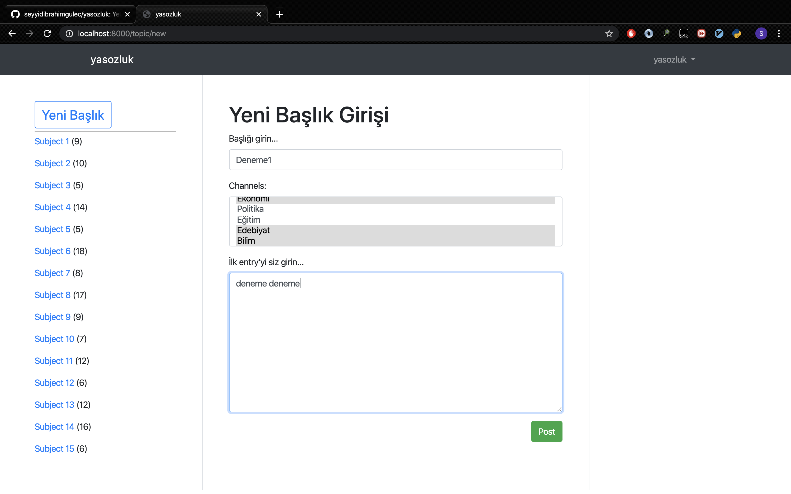
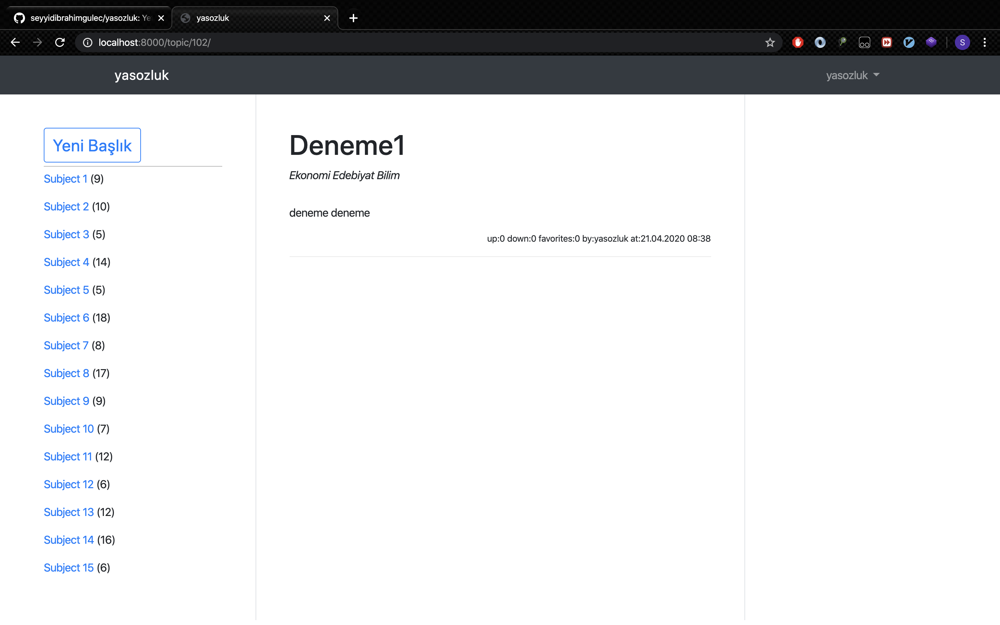

# Yet Another Ekşi Sözlük Clone

# Table of Contents <!-- :TOC: -->
- [Yet Another Ekşi Sözlük Clone](#yet-another-ekşi-sözlük-clone)
- [Installation](#installation)
- [Usage](#usage)
- [Contributors](#contributors)

# Installation

1. Clone this repository:

    `$ git clone https://github.com/seyyidibrahimgulec/yasozluk.git`

2. Create a [virtual environment](https://docs.python.org/3/library/venv.html#creating-virtual-environments
   "Official documentation") in the project folder:

    `$ python -m venv venv`

3. Activate the virtual environment:

    `$ source venv/bin/activate`

4. Install the requirements:

    `$ pip install -r requirements.txt`
    
5. Create database

    `$ psql`
    `$ CREATE DATABASE yasozluk;`

6. Migrate database

    `$ python manage.py migrate`

# Usage

1. To start server, run this command in the project directory:

    `$ python manage.py runserver`

2. Open http://localhost:8000 to view it in the browser.

# Screenshots

# Contributors

- [KaratasFurkan](https://github.com/KaratasFurkan)
- [budancamanak](https://github.com/budancamanak)
- [mertturkmenoglu](https://github.com/mertturkmenoglu)
- [seyyidibrahimgulec](https://github.com/seyyidibrahimgulec)
